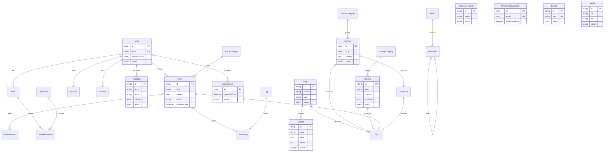

# Diagramme de données FancyVision

Les tables autonomes `Faq`, `Testimonial`, `TeamMember`, `Media`, `NewsletterSubscriber`, `ContactRequest`, `Setting`, `Redirect` et `AnalyticsEvent` sont volontairement indépendantes afin de simplifier leur CRUD et leur indexation.
